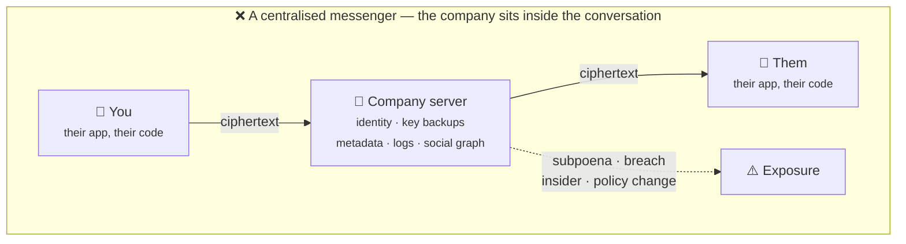
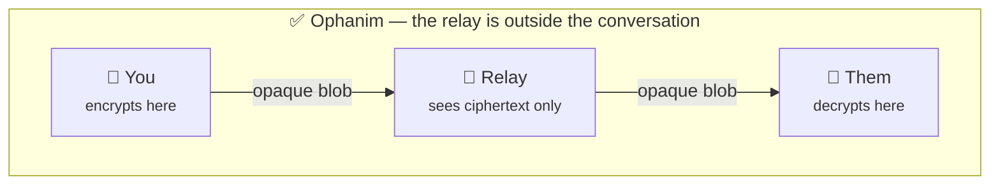
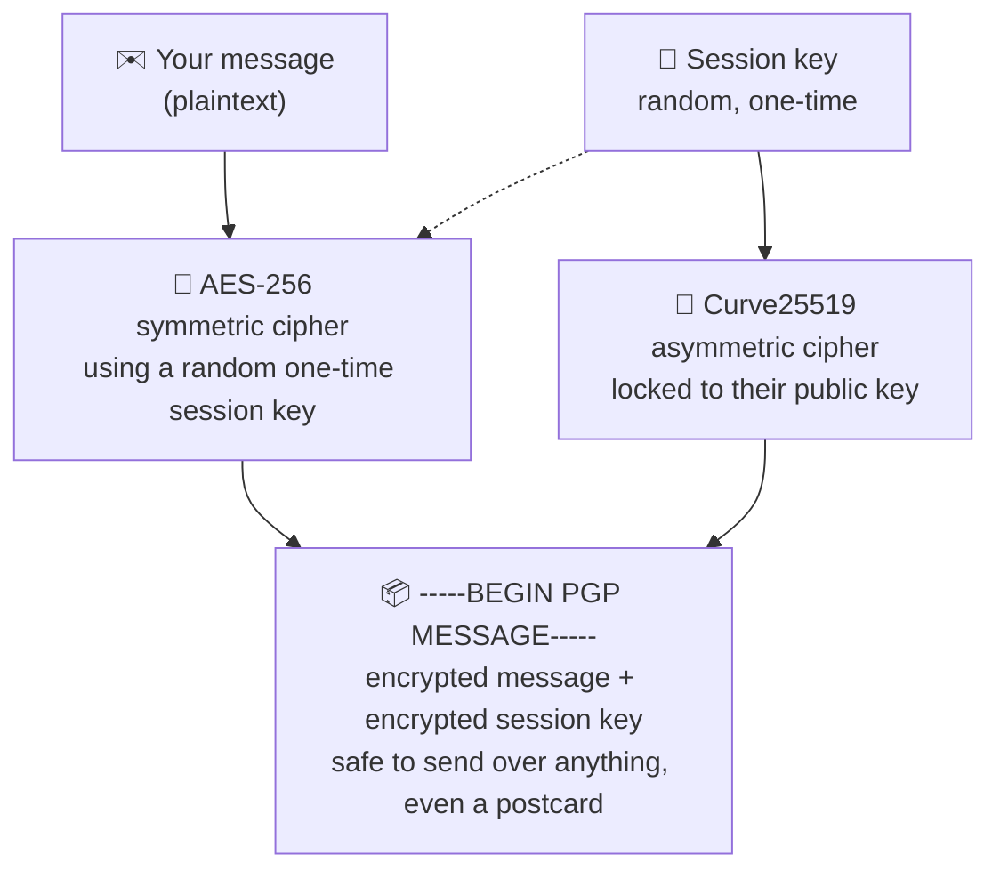
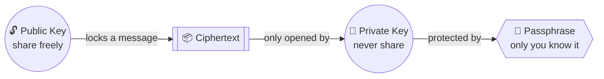
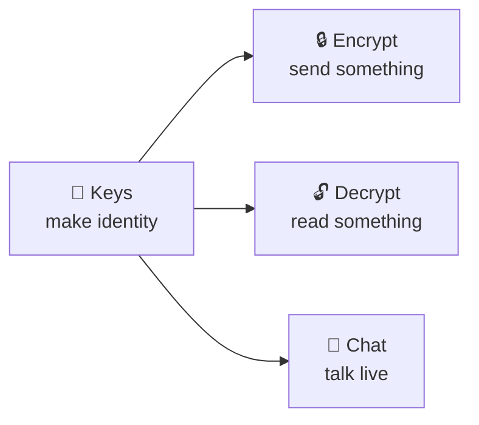
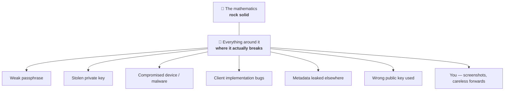
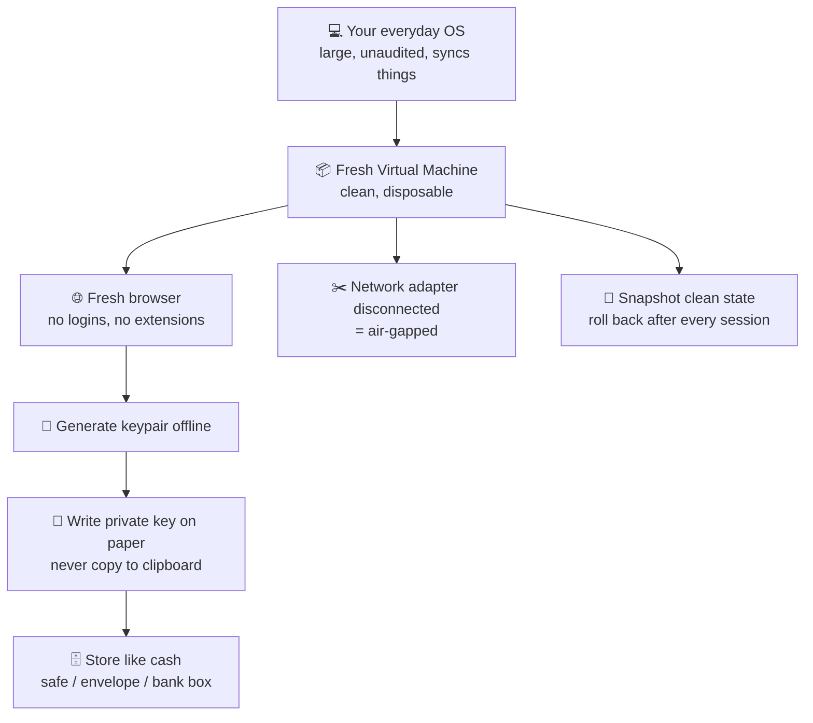

# 🜂 The Ophanim Manual

> *Everything Ophanim does, why it's built the way it is, and how to use it — written for someone who has never touched PGP in their life. Read it end to end once; after that you'll only ever need Section 4.*

<p align="center">
  
  
  
  
</p>

---

## 📖 Contents

| # | Section |
|---|---|
| 01 | [What Ophanim is](#01--what-ophanim-is) |
| 02 | [Why this is different](#02--why-this-is-different-from-whatsapp-instagram-and-the-rest) |
| 03 | [What PGP actually is](#03--what-pgp-actually-is) |
| 04 | [Public key & private key](#04--public-key-private-key-passphrase-fingerprint) |
| 05 | [Using Ophanim, step by step](#05--using-ophanim-step-by-step) |
| 06 | [The maths behind it](#06--the-maths-behind-it--why-this-cannot-be-cracked) |
| 07 | [Why no shortcut exists](#07--why-no-shortcut-exists) |
| 08 | [What can actually go wrong](#08--what-can-actually-go-wrong) |
| 09 | [Maximum paranoia mode](#09--maximum-paranoia-mode) |
| 10 | [Honest words from the author](#10--honest-words-from-the-author) |
| 11 | [Glossary](#11--glossary) |

---

## 01 · What Ophanim is

A message that is encrypted **before** it leaves your device, and can only be turned back into words on the device of the person you wrote it for. Nothing in between — not the network, not the server, not the person who runs the server — ever sees anything but noise.

Ophanim is three small tools and one chat room, all built on **OpenPGP**, the same encryption standard journalists, security researchers and paranoid engineers have relied on since 1991.

| Tool | Does |
|---|---|
| 🔑 **Keys** | Makes your identity: a Curve25519 keypair, generated in your browser and stored only on your device |
| 🔒 **Encrypt** | Turns a message into a block of armoured ciphertext addressed to one person's public key |
| 🔓 **Decrypt** | Turns a block of ciphertext addressed to you back into readable text, using your private key + passphrase |
| 💬 **Chat** | A live room where the same thing happens automatically, per message, per recipient |

The important part is what is **absent**. No sign-up. No phone number. No email verification. No password stored anywhere. No profile, no contact list uploaded, no "who talked to whom at 2am" table sitting in a database waiting to be subpoenaed, breached, or sold. Your keypair lives in this browser's local storage on this device, and that is the whole of your account.

> *If a service cannot read your messages, it cannot hand them over, lose them in a breach, or change its mind about them later.*

```
┌─────────────────────────────────────────────────┐
│  ✦  THE ONE-LINE VERSION                         │
│                                                   │
│  Ophanim is a padlock factory, not a post office.│
│  It makes the locks. It never holds the keys,    │
│  and it never opens the envelopes.               │
└─────────────────────────────────────────────────┘
```

---

## 02 · Why this is different from WhatsApp, Instagram and the rest

Mainstream messengers advertise "end-to-end encryption," and for the message body, many of them mean it. The difference is everything that *surrounds* the message — and who is holding the keys while it happens.





Same shape, different trust. In the top diagram the server is a *participant*: it issues your identity, can back up or replace your keys, and records the shape of every conversation. In the bottom one the server is a dumb pipe that could be replaced with a carrier pigeon without weakening anything.

### The three things a mainstream messenger keeps

1. **Your identity.** A phone number or an email, tied to you, tied to a SIM, tied to a bank card. The message may be encrypted; the fact that *you* sent it is not.
2. **Your keys — or the ability to replace them.** The app generates and manages keys for you, silently. If the server ever hands your contact a different public key than the one you think you're using, you would never notice, because you were never shown one.
3. **Your metadata.** Who, when, how often, how long, from where, on what device. Metadata is not a footnote to the message — for an investigator it is frequently more useful than the message itself. *"We kill people based on metadata"* is a direct quote from a former NSA and CIA director.

Add the practical leaks: **cloud backups**. A WhatsApp chat backed up to iCloud or Google Drive has historically left the encrypted world entirely; the strongest cryptography in the world does not survive being written to a third party's disk in plaintext. And every one of these companies is a legal entity with an address, a compliance department, and an obligation to answer court orders.

| | WhatsApp / Instagram | Ophanim |
|---|---|---|
| Who makes your keys | The app, on their terms, invisibly | ✅ You, in your browser, and you can read them |
| Where keys are stored | Device, often plus a cloud backup | ✅ This device only. Nothing syncs. |
| Identity required | Phone number or email | ✅ None. A keypair and a room code. |
| Metadata retained | ❌ Extensive and permanent | ✅ A room code and a socket, gone when you leave |
| Server can read messages | No — but it defines the code that decides | ✅ No, and it never receives anything but ciphertext |
| Useful subpoena target | ❌ Yes — a company, with records | ✅ There is nothing on it to hand over |
| Ciphertext you can inspect | ❌ Never shown to you | ✅ Shown, copyable, portable to any PGP tool |

> **Fair to Signal:** Signal is genuinely good, genuinely audited, and run by people who care. It still asks for a phone number, still runs the code that manages your keys, and is still a single organisation that could be compelled or compromised. Ophanim's answer is cruder but structurally different — the ciphertext is a text file *you* hold, and the relay is disposable.

---

## 03 · What PGP actually is

**PGP** stands for *Pretty Good Privacy* — a deliberately modest name for something that has never been broken. It was written by Phil Zimmermann in 1991, published openly, and has been picked at by cryptographers ever since. Ophanim speaks **OpenPGP**, the open standard that grew out of it.

Before PGP, encryption had a chicken-and-egg problem: to send someone a secret, you both needed the same secret key — but how do you get them the key without sending it over the channel you don't trust?

PGP's answer is **public key cryptography**: two keys instead of one, mathematically bound together, where one can be shouted from a rooftop and the other never leaves your hands.

### The hybrid scheme, in order

Public key maths is slow and awkward with large inputs, so PGP never encrypts your actual message with it directly. Every message goes through this sequence:



1. A brand-new random **session key** is generated, used for this one message and never again.
2. Your message is encrypted with that session key using **symmetric encryption** — fast, and unbreakable at this key size.
3. The session key itself — a tiny thing — is encrypted with the **recipient's public key**.
4. Both blocks are wrapped together in ASCII armour: the `-----BEGIN PGP MESSAGE-----` block you can paste anywhere.
5. The recipient's private key unwraps the session key; the session key unwraps the message. In that order, and no other.

Two layers, two different kinds of maths. An attacker must break **both** — and there is no known way to break either. Ophanim uses OpenPGP.js with Curve25519 keys and AES session keys, entirely inside your browser tab.

---

## 04 · Public key, private key, passphrase, fingerprint

Four words. Once these are clear, the whole tool is obvious — and so is every other PGP program you'll ever open.

<table>
<tr>
<td width="50%" valign="top">

### 🔓 Your public key
*An open padlock.*

You hand copies to anyone: post it publicly, put it in your email signature, tattoo it on your arm. It does exactly one useful thing — it lets someone lock a message so that only you can open it.

It cannot decrypt. It cannot be used to work out your private key. Giving it away costs you nothing.

| | |
|---|---|
| Looks like | `BEGIN PGP PUBLIC KEY BLOCK` |
| Share it | 🟢 **Freely** |

</td>
<td width="50%" valign="top">

### 🔐 Your private key
*The only key that opens those padlocks.*

It never leaves your device, is never sent to a server, and is never shown to anyone — including me.

If someone gets this file **and** your passphrase, they can read every message ever sent to you and impersonate you convincingly. If you lose it, those messages are gone permanently. There is no reset link. That is the point.

| | |
|---|---|
| Looks like | `BEGIN PGP PRIVATE KEY BLOCK` |
| Share it | 🔴 **Never. Not once.** |

</td>
</tr>
</table>



### The passphrase

Your private key is itself encrypted, with a passphrase you choose. So stealing the key file is not enough — an attacker also has to guess the passphrase. This is the single weakest link in the whole system, because it's the only part chosen by a human rather than by mathematics.

> **Choose it like this:** four to six unrelated words, from your own head, that form a picture you cannot forget — `brass otter tuesday landfill`. Long and memorable beats short and cryptic every time. Never reuse a password you've typed into any website. The **Passphrase** field on the Keys page shows a strength meter as you type; treat it as a floor, not a target.

### The fingerprint

A key is thousands of characters long, so nobody compares them by eye. Instead each key has a **fingerprint** — a short string derived from it, like `3A7F 91C4 22B8 0E15`. Two different keys cannot share a fingerprint.

This is what defeats the one attack the maths cannot: someone quietly substituting their own public key for your friend's, so that messages you think are locked to her are actually locked to them. Read the fingerprint to your contact over a *different* channel — a phone call where you recognise their voice, or in person — and compare. Ophanim won't let you send in a chat room until you've confirmed the other person's fingerprint, and it's not being precious: this check is the whole of your protection against impersonation.

### Signing, briefly

Encryption hides *what* was said. A signature proves *who* said it, and that nothing was altered in transit — made with your private key, verified by anyone holding your public key. Encrypting proves nothing about the author; signing proves nothing about secrecy. Real messages usually want both.

---

## 05 · Using Ophanim, step by step

Four pages, in the order you'll need them. Do the first one once; the rest are a minute each, forever after.



### A · Make your identity — the **Keys** page

> You only do this once per device. Everything else depends on it.

1. **Open Keys and fill in "Create a keypair."** `Name` and `Email` are labels, not verification — nothing is checked or sent anywhere. They exist so you and your contacts can tell keys apart. If you want to be unidentifiable, put nonsense in both. `corvid` / `corvid@nowhere.invalid` works perfectly.
2. **Choose a passphrase you cannot lose.** Watch the strength meter. This passphrase encrypts your private key on this device; if you forget it, the key is scrap and every message sent to it is unreadable, permanently. Nobody can recover it — not me, not anyone.
3. **Press "Generate keypair."** Curve25519 keys are generated in your browser using the OS's cryptographic random number generator. It takes a moment. Nothing is transmitted — you can disconnect from the internet entirely and this still works.
4. **Back up the private key *now*, before you use it.** Use "Copy private key" and store it somewhere you control — an encrypted USB stick, a password manager, or paper in a safe. Browser storage is not a vault: clearing site data, private browsing, or a new profile will take the key with it. This is the #1 way people lose access to their own messages.
5. **Send your "Copy public key" block to people.** Post it, email it, message it — it's public by design. Then add theirs under "Add a contact" so you never have to paste it again. With several keypairs, "Use" marks which is your active identity.

### B · Send something — the **Encrypt** page

1. **Type into `Message`.** Anything. It never leaves the tab in this form.
2. **Put their key in `Recipient's public key`.** Either "Choose a contact" to pull a saved key, or paste a public key block directly. The `Key check` panel reads the key back to you — name and fingerprint. **Look at it.** That's the moment you catch a wrong or swapped key.
3. **Press "Encrypt message."** The `Ciphertext` box fills with a `-----BEGIN PGP MESSAGE-----` block, locked to that one public key. Even *you* can't read it back — you don't hold the private key it was addressed to.
4. **Send the block anywhere you like.** "Copy" it into WhatsApp, an email, a forum post, a printed page; or "Download .pgp" and send the file. The channel doesn't need to be trustworthy — that's the whole point. Encrypted words in an insecure app are safer than plain words in a secure one.

### C · Read something — the **Decrypt** page

1. **Paste the whole block into `Encrypted message`.** Include the `BEGIN` and `END` lines. A block that's been word-wrapped or mangled by a chat app will fail to decrypt — that's a corruption failure, not a security failure. Ask for it again as a file.
2. **Supply your private key.** "Use a saved key" picks one from this device; "Paste a key" lets you use a key that lives elsewhere — handy on a machine where you deliberately store nothing.
3. **Enter your `Passphrase` and press "Decrypt message."** The passphrase unlocks your private key in memory only. Not stored, not logged, not transmitted. The plaintext appears on the pale `Message` surface — paper, in this app's visual language: the impression pulled off the plate.
4. **Press "Clear now" when you've read it.** Decrypted text on screen is the least protected thing in the whole system — readable by anyone behind you, a screenshot, a screen recorder. Clear it deliberately rather than leaving the tab open all day.

### D · Talk live — the **Chat** page

1. **"Start a room" or "Join a room."** Give a display name, pick "Your keypair," enter its passphrase. Starting produces a `Room code`; whoever you send that code to can join. Send it over a channel that isn't the one you're worried about.
2. **Check the fingerprint before you say anything.** The message box stays locked until you do. Ophanim shows you the other person's fingerprint; read it aloud on a call, or compare in person, then confirm. This is the one step that cannot be automated, because it's the one step that requires you to recognise a human being.
3. **Type.** Every message is encrypted separately for every recipient. The relay receives a bundle of ciphertexts and forwards them. It holds a room code, a socket, and a display name you invented — and forgets even that when the room ends. Temporary rooms expire after 24 hours on their own.
4. **Know what the "Kill switch" does.** It destroys the room for everyone in it **and wipes every key stored in this browser** — including your keypair. If you haven't backed it up elsewhere, it's gone, and so is everything encrypted to it. It's a fire alarm, not a logout button.

> **Portable by design:** Ciphertext from Ophanim is ordinary OpenPGP. Your contact can decrypt it in Kleopatra, GnuPG, Thunderbird, Proton Mail, or anything else that speaks the standard — and you can decrypt theirs here. Nothing you make is locked to this site. You're not a user of a platform; you hold keys.

---

## 06 · The maths behind it — why this cannot be cracked

Not "difficult to crack." Not "expensive to crack." There is no adversary — no police force, no intelligence agency, no billionaire, no botnet — with a *known method* of reading a properly encrypted PGP message without the private key. The obstacle is not budget. **It is physics.**

An attacker holding your ciphertext has to break one of the two layers from Section 3.

### Layer one — the symmetric cipher

The message body is encrypted with **AES-256**. To brute-force it you try keys until one works: roughly `2²⁵⁶` possibilities — about `1.16 × 10⁷⁷`, comparable to the number of atoms in the observable universe.

Suppose you could test a trillion keys per second, on a trillion machines, running since the Big Bang. You would not have made a measurable dent — not one percent, not one billionth of one percent. This isn't rhetoric; it falls straight out of the arithmetic. There's also a thermodynamic floor: simply *counting* to 2²⁵⁶ with perfectly efficient hardware would consume more energy than the sun will emit in its entire lifetime.

### Layer two — the public key maths

The session key is locked with asymmetric cryptography. Ophanim uses **Curve25519**; classical PGP setups use **RSA-2048 or RSA-4096**. Both rest on problems with no known efficient solution:

- **RSA** — you must factor an enormous number back into its two prime components. The best known classical method, the General Number Field Sieve, scales so badly that a 4096-bit modulus is far beyond any physically achievable computation.
- **Curve25519** — you must solve the elliptic curve discrete logarithm problem, which is *harder* than factoring at equivalent security levels. That's why a 256-bit elliptic curve key matches the strength of a 3072-bit RSA key, while being far smaller and faster.

| Layer | What an attacker must do | Search space | Best known attack |
|---|---|---|---|
| AES-256 | Try every possible session key | `2²⁵⁶` | Brute force. Nothing faster exists. |
| Curve25519 | Solve the elliptic curve discrete log | `≈2¹²⁸` work | Generic. No structural break known. |
| RSA-4096 | Factor a 4096-bit modulus | `≈2¹⁵⁰` work | Number Field Sieve — infeasible at this size |
| RSA-512 *(historic)* | Factor a 512-bit modulus | small | ❌ Broken in the 1990s — why key sizes grew |

> **Plainly:** correctly used, this cannot be broken by law enforcement, an intelligence service, or anyone else — because nobody on Earth has an algorithm that reads AES-256, Curve25519, or RSA-4096 faster than trying every key, and trying every key is not a thing the universe has the resources to do. The word "unbreakable" makes cryptographers itch, so here's the precise version: *no known method exists, and the brute-force cost exceeds the physical resources available.*

---

## 07 · Why no shortcut exists

The obvious question: if these algorithms are so important, surely someone has found a clever way around them and kept quiet?

**Because it's all been public for thirty-five years.** PGP has been open since 1991. AES was chosen through a public international competition. Curve25519's design and rationale are published in full. Every academic cryptographer on the planet has had decades of free access and a strong career incentive to break them. The best published attacks shave a negligible margin off brute force and require impossible quantities of data. Secret mathematics is a film plot; real cryptanalysis is a slow public grind that leaves papers behind.

**Because the weak versions were retired.** Cryptography does age. 512-bit RSA fell. DES fell. MD5 and SHA-1 fell for signing. In every case the community saw it coming, published the arithmetic years ahead, and moved on. That's the system working — and why modern PGP uses 2048-bit RSA minimum, or elliptic curves.

**What about quantum computers?** This is the one honest asterisk. A sufficiently large quantum computer running **Shor's algorithm** would break RSA and elliptic curve cryptography — including Curve25519. That machine does not exist. Today's devices are many orders of magnitude short: they'd need millions of stable logical qubits, and the field is currently counting in the hundreds of noisy physical ones.

- **Symmetric encryption survives.** Grover's algorithm halves AES-256's effective strength to ~128 bits — still comfortably beyond reach, forever, which is precisely why 256 was chosen.
- **"Harvest now, decrypt later" is the real concern.** An adversary storing your ciphertext today could read it decades from now if that machine ever arrives. If your secret must stay secret past 2050, factor that in.
- **Post-quantum algorithms are already standardised** and working their way into OpenPGP. When they land, keys get rotated. The system is designed for exactly that.

> *Nobody breaks the encryption. They go around it — and they go around it through you.*

---

## 08 · What can actually go wrong

The cryptography is the strongest component in the system, by an enormous margin. Every real-world compromise in PGP's history happened somewhere else. Here is where, honestly.



- **A weak passphrase.** Your private key is only as strong as the words guarding it. `Summer2024!` is not a passphrase; it's a delay.
- **A stolen private key.** If someone gets the key file *and* the passphrase, the mathematics becomes irrelevant. Everything ever encrypted to you is readable, and they can sign as you.
- **A compromised device.** Malware, a keylogger, a hostile browser extension, or spyware reads your message *before* it's encrypted and *after* it's decrypted. This is how real operations against PGP users are actually run. The endpoint is the battlefield.
- **Implementation bugs.** The 2018 Efail vulnerabilities targeted how email clients handled decrypted content and HTML — not the cryptography itself. Client software is where the flaws live.
- **Metadata you leak elsewhere.** The message is opaque, but a ciphertext block emailed from your named account, at a known time, to a known address, still tells a story. Ophanim closes the message; it cannot close the channel you chose.
- **The wrong public key.** If you encrypt to a key that isn't actually your contact's, you've encrypted perfectly — to your adversary. This is what fingerprint verification is for, and skipping it is the most common self-inflicted defeat.
- **You.** A screenshot, a copy-paste into the wrong window, a plaintext draft in a cloud notes app, the same message forwarded to someone chattier than you. Cryptography does not survive contact with a careless human.

> **Law enforcement, realistically:** they will not break the encryption, because they cannot. They will seize the device while it's unlocked, image the disk, obtain the ciphertext from the other end of the conversation, install monitoring software, subpoena whatever service carried the block, or — in several jurisdictions — legally compel you to produce the passphrase. Strong cryptography moves the fight from the maths to your operational discipline. Section 9 is about that discipline.

---

## 09 · Maximum paranoia mode

Everything above is enough for ordinary privacy. If you want the version with no soft edges — where the key never touches an ordinary operating system, never touches a clipboard, and never touches a disk you cannot destroy — this is how it's done. It's inconvenient on purpose.



### 1 · Generate keys inside a virtual machine

Your everyday operating system is enormous, full of software you didn't audit, and syncs things to places you've forgotten about. A VM is a clean, disposable computer that lives in a window.

- **Install a hypervisor** — VirtualBox or VMware on Windows/macOS, GNOME Boxes, virt-manager or KVM on Linux. All free.
- **Install a small, boring Linux inside it** — Debian, Fedora or Ubuntu is fine. For the serious version, run **Tails**, which boots from a USB stick, routes traffic over Tor, and forgets everything at shutdown by design; or **Whonix**, built to run as a pair of VMs.
- **Give the VM a fresh browser and nothing else.** No extensions, no logins, no password manager, no signed-in profile. A browser that has never authenticated to anything cannot leak an identity.
- **Turn off shared folders, shared clipboard, and drag-and-drop** in the VM settings. These are convenience features and exactly the bridge you're trying not to build. One checkbox, and it matters more than most of this page.
- **Snapshot the clean state.** Roll back to it after every session and the machine has no memory of what you did.
- **For the strongest version, air-gap it.** Disconnect the VM's network adapter entirely, or use an old laptop with the Wi-Fi card physically removed. Key generation and decryption need no internet whatsoever — Ophanim's pages run offline from local files.

### 2 · Write the keys down instead of copying them

A clipboard is shared memory. Other applications can read it, some OSes sync it between devices, and clipboard managers keep a searchable history of everything you've ever copied — which, for a private key, is a catastrophe with a timestamp on it.

- **Transcribe the private key by hand** onto paper, or print it from the air-gapped machine to a non-networked printer. Paper doesn't phone home, doesn't get ransomwared, and doesn't sync to a cloud you forgot you enabled.
- **Store the paper like cash** — a safe, a sealed envelope, a bank box. Two copies in two places beats one perfect copy. Consider a fireproof bag; the historically common way to lose a paper key is a house fire, not a burglar.
- **Never store the passphrase with the key.** Different medium, different room, different person if need be.
- **Verify the transcription before you rely on it.** Type it back in on the Decrypt page and decrypt a test message. A key with one wrong character is not a key. Discover this now, not in an emergency.
- **Fingerprints are the exception.** Read those aloud — over a phone call, in person, in a voice you recognise. They're public and short, and reading them out *is* the whole verification ritual.

### 3 · Those keys work everywhere

A key written on paper is not an "Ophanim key." It's an **OpenPGP** key. Type it into this site, or into Kleopatra, GnuPG, Thunderbird, Proton Mail, or a client that doesn't exist yet — they all speak the same standard. Encrypt here, decrypt there, or the reverse, indefinitely. Nothing about your identity depends on this site continuing to exist, and that independence is deliberate.

### 4 · Habits that matter more than tools

- Use full-disk encryption on every machine involved. An unencrypted laptop is a filing cabinet with a paper lock.
- Assume anything decrypted on screen may be photographed. Read, act, clear.
- Keep your identity and your pseudonym completely separate — different machine, different network, different browser, no crossover, ever. One habit break links them permanently.
- Rotate keys occasionally, and keep the old private key so you can still read old messages.
- Send the room code and the ciphertext over different channels where you can. Splitting the pieces splits the compromise.
- Remember that the person you're writing to is half your security posture, and you cannot patch them.

> ⚠️ **If lives depend on it, do not use this site.** Use **Kleopatra** (the GnuPG front-end, part of Gpg4win on Windows, available on Linux and macOS) or GnuPG on the command line. They are audited, decades old, maintained by large teams, and are desktop software rather than a web page — which removes an entire category of risk no browser tool can fully close. Pair it with Tails and a hardware key. Ophanim is built with care and the cryptography under it is the real thing, but "built with care by one person" and "audited by the security community for twenty years" are not the same sentence, and I'm not going to pretend otherwise.

---

## 10 · Honest words from the author

Ophanim is a standalone project, designed and built by **Joshua Barboza**. Not a company, not a startup, not a team — one person who thinks the ability to say something to exactly one other human being is a thing worth building properly.

So, plainly: **it has flaws.** All software does; software written by one person and never put through a formal audit has them in places nobody's looked yet. The cryptography underneath is OpenPGP.js, which is real, respected, widely used code. Everything wrapped around it is mine. A browser tab is also a genuinely harder place to guarantee secrets than a native application: extensions, the page lifecycle, memory you don't control. I've kept the design tight — keys never leave your device, the server only ever handles ciphertext, no accounts, no logs, no telemetry, self-hosted fonts so not even a font CDN learns you were here — but design intent is not the same thing as a security guarantee, and you shouldn't accept it as one.

> *Use Ophanim because you value privacy. Use Kleopatra when being wrong about privacy would cost you something you cannot afford to lose.*

And if your situation is the serious kind — you're a journalist protecting a source, a whistleblower, an activist somewhere the government reads the post, a lawyer, a doctor, someone leaving a dangerous house, or, let's be realistic about who reads manuals like this one, someone doing something they'd rather the authorities didn't read 😏 — then use **Kleopatra / OpenPGP** on a machine you control, and treat this site as the thing that taught you how it works.

Everyone else — the overwhelming majority, people like me who simply don't think a private conversation should require anyone's permission — welcome. That's what this was built for. Privacy isn't something you should have to justify wanting; you close the bathroom door and you have nothing to hide there either.

> **The disclaimer, said once, seriously:** No warranty. No liability. No promises about your threat model, because I don't know it and you should be suspicious of anyone who claims they do. Read the code — it's right there in your browser, which is more than most messengers will offer you.

---

## 11 · Glossary

| Term | Meaning |
|---|---|
| **PGP / OpenPGP** | Pretty Good Privacy, 1991, and the open standard derived from it. The encryption format this site speaks. |
| **Keypair** | Your public key and private key together — one mathematical object, two halves with opposite jobs. |
| **Public key** | The open padlock you give away. Others use it to lock messages that only you can open. |
| **Private key** | The only thing that opens those locks. Kept on your device, encrypted with your passphrase, never shared. |
| **Passphrase** | The words that encrypt your private key at rest. Not recoverable. Not stored anywhere. |
| **Fingerprint** | A short unique string identifying a key. Compared out loud to confirm you have the right person's key. |
| **Ciphertext** | The encrypted output. Meaningless without the private key. Safe to send over anything. |
| **Plaintext** | The readable message, before encryption or after decryption. The vulnerable state. |
| **ASCII armour** | The BEGIN/END text wrapper that lets binary ciphertext travel through chat apps and email intact. |
| **Session key** | A random single-use key that encrypts one message body. Itself encrypted to the recipient's public key. |
| **AES-256** | The symmetric cipher doing the bulk work. `2²⁵⁶` possible keys; no practical attack exists. |
| **Curve25519** | The elliptic curve used for Ophanim's keypairs. Small, fast, and stronger than RSA at equivalent size. |
| **RSA** | The older public-key system, based on factoring large numbers. Still fine at 2048 bits and above. |
| **End-to-end (E2E)** | Encrypted on your device, decrypted on theirs, and readable nowhere in between — including on the server. |
| **Zero-knowledge** | The service holds nothing it could reveal: no keys, no plaintext, no account. It cannot betray what it never had. |
| **Metadata** | Everything about a message that is not the message: who, when, how often, from where. Frequently more revealing than the content. |
| **Air-gap** | A machine with no network connection at all. The strongest practical protection for a private key. |
| **Kleopatra** | The mature desktop GnuPG front-end. What to use when the stakes are real. |

---

<p align="center">
<sub>
<b>Ophanim</b> — client-side OpenPGP, built by Joshua Barboza. Encryption by OpenPGP.js.<br>
Keys generated with Curve25519, held only in your browser, on your device.<br>
No accounts, no logs, no telemetry, no third-party fonts or scripts. The relay handles ciphertext and nothing else.<br><br>
Read this once, verify a fingerprint, and go and have a private conversation. 🜂
</sub>
</p>
