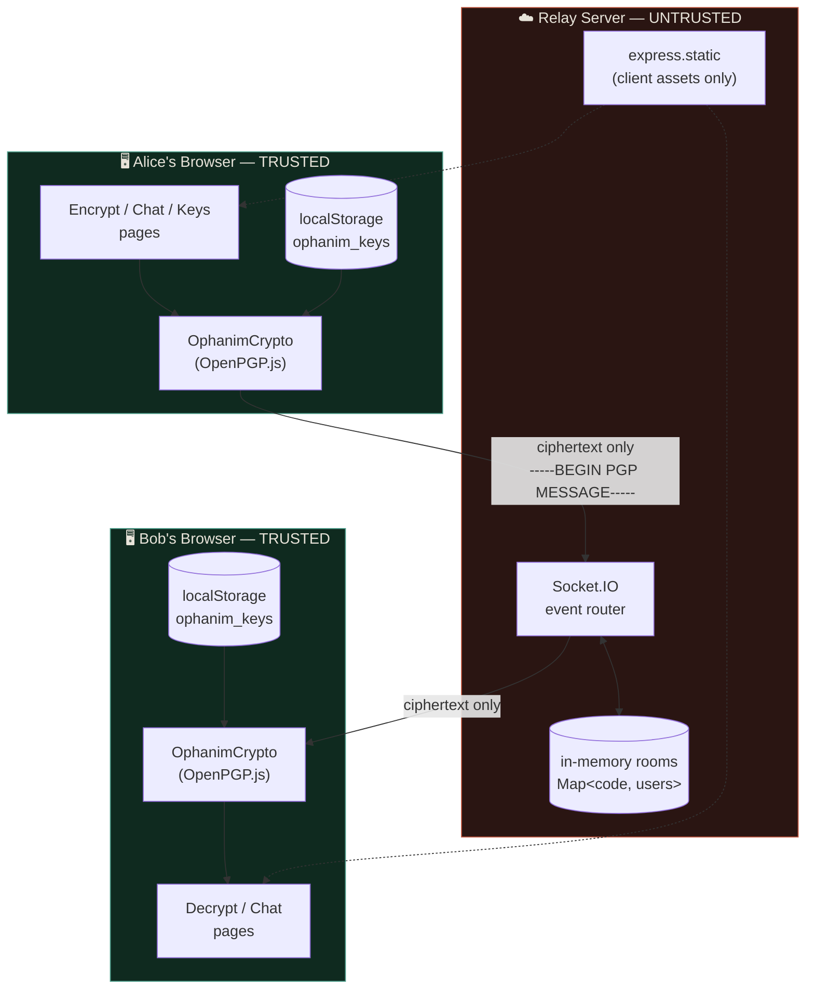
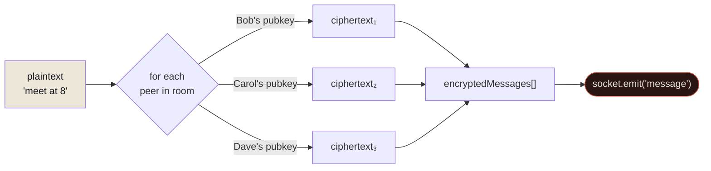
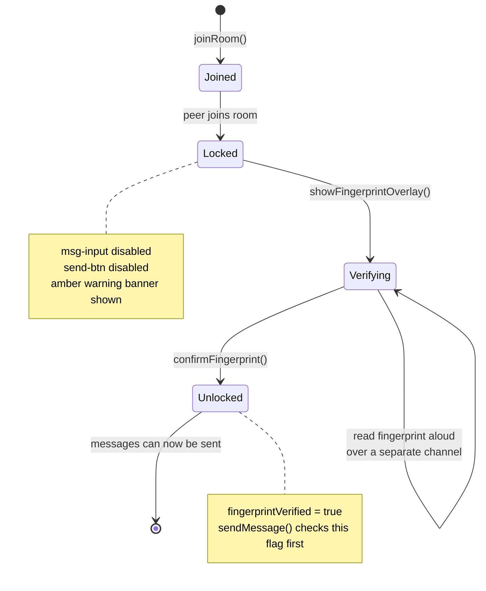
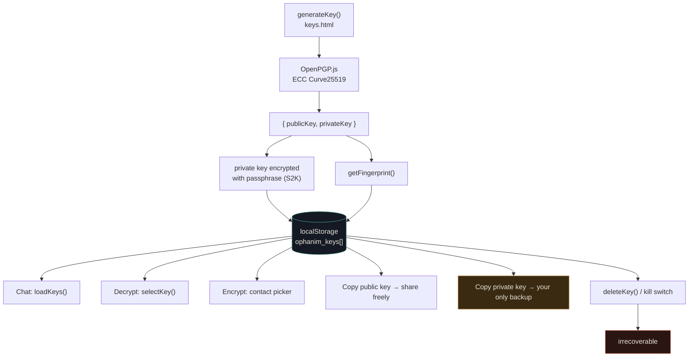
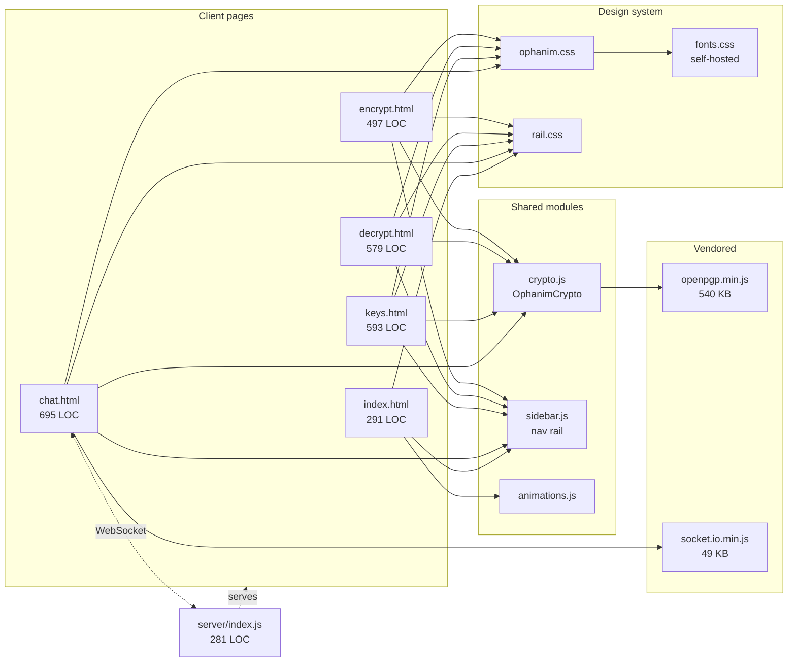
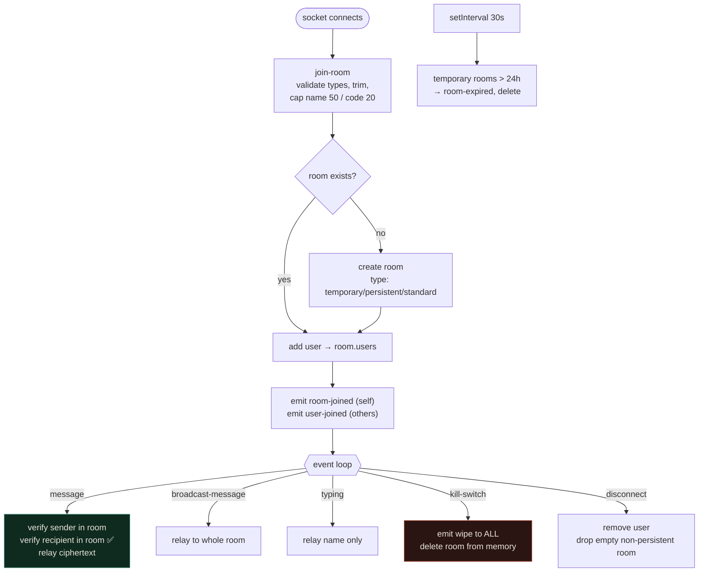
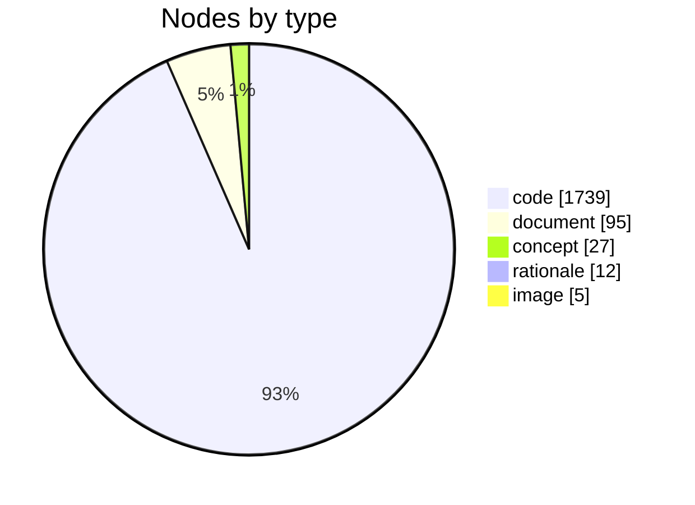
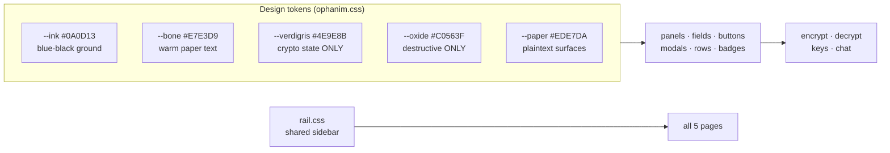

# Ophanim — Project Report

> A zero-knowledge, end-to-end encrypted messaging platform that runs entirely in the browser.
> The server relays ciphertext and nothing else.

| | |
|---|---|
| **Repository** | `Seraphim` (branch `stablev2`) |
| **Product name** | Ophanim |
| **Crypto core** | OpenPGP.js v5.11.2 — ECC Curve25519 |
| **Transport** | Socket.IO 4.7.4 over WebSocket |
| **Server** | Express 4 relay, 281 LOC, zero message persistence |
| **Client** | 5 static HTML pages, no framework, no build step |
| **History** | 17 commits · 2026-05-02 → 2026-09-04 |
| **Report generated** | 2026-09-04 |

---

## 1. Executive summary

Ophanim is a PGP messenger built on a single hard constraint: **the server must be incapable of reading anything it carries.** Every keypair is generated in the browser, every private key stays in that browser's `localStorage`, and every message is encrypted to the recipient's public key *before* it reaches the network. The relay sees an opaque armored blob, a room code, and a socket ID — nothing else.

That constraint drives nearly every design decision in the codebase, and it's also what makes the project easy to reason about: there is no account system, no database, no session store, no password reset flow, because there is nothing on the server worth protecting.

**Three things distinguish it from "yet another chat app":**

1. **No account, ever.** Identity is a Curve25519 keypair held on one device. There is nothing to sign into and nothing to sync.
2. **Out-of-band fingerprint verification is enforced, not optional.** The message input stays disabled until you confirm your peer's fingerprint — a deliberate friction that closes the key-substitution attack a relay operator could otherwise mount.
3. **Destruction is a first-class feature.** A kill switch wipes the room for every participant; decrypted plaintext self-destructs on a countdown; leaving a room clears the transcript.

---

## 2. How it works — the whole system in one picture

**Read the diagram like this:** everything green is trusted and holds secrets. Everything red is assumed hostile. The only thing that ever crosses between them is an armored PGP block that the red zone cannot open.

---

## 3. The trust boundary — what the server can and cannot see

This is the most important table in this document.

| Data | Lives in browser | Crosses the wire | Server can read it |
|---|:---:|:---:|:---:|
| Private key | ✅ | ❌ | **No** |
| Passphrase | ✅ (memory only) | ❌ | **No** |
| Message plaintext | ✅ | ❌ | **No** |
| Message ciphertext | ✅ | ✅ | Opaque blob only |
| Public key | ✅ | ✅ | ✅ (by design — it's public) |
| Display name | ✅ | ✅ | ✅ |
| Room code | ✅ | ✅ | ✅ |
| Socket ID | — | ✅ | ✅ |

**What a hostile relay operator still learns:** who is in which room, when they talk, how often, and how large the messages are. Ophanim protects *content*, not *metadata*. This is an honest limitation shared with most E2EE systems that lack onion routing or cover traffic — it is worth stating plainly rather than implying otherwise.

**What a hostile relay operator cannot do:** read a message, forge a message that decrypts correctly, or silently substitute their own key for a peer's — the last one is blocked specifically by the fingerprint gate in §5.

---

## 4. Message lifecycle — encrypt → relay → decrypt

```mermaid
sequenceDiagram
    autonumber
    participant A as Alice (browser)
    participant S as Relay Server
    participant B as Bob (browser)

    Note over A,B: Setup — public keys exchanged inside the room
    A->>S: join-room {roomCode, name, publicKey}
    S->>B: user-joined {id, name, publicKey}
    S-->>A: room-joined {users[], roomType, createdAt}

    Note over A,B: 🔒 Fingerprint gate — input stays disabled until confirmed
    A->>A: formatFingerprint() → read aloud out-of-band
    B->>B: compare fingerprint → confirmFingerprint()

    Note over A: Encryption happens BEFORE the network
    A->>A: OphanimCrypto.encryptMessage(text, bobPubKey)
    A->>S: message {roomCode, [{recipientId, ciphertext}]}

    rect rgb(60, 25, 20)
    Note over S: Server validates room membership,<br/>relays blob, stores NOTHING
    end

    S->>B: message {senderId, senderName, ciphertext, timestamp}
    B->>B: OphanimCrypto.decryptMessage(ct, privKey, passphrase)
    B->>B: render via .textContent (never innerHTML)
```

### Per-recipient fan-out

Ophanim does not use a shared group key. `sendMessage()` loops over every peer in the room and produces **one ciphertext per recipient**, each encrypted to that person's individual public key:

**Trade-off, stated honestly:** bandwidth scales O(n) with room size and a failed encryption for one recipient is skipped silently. In exchange, there is no group key to leak, compromise of one recipient reveals nothing about the others' ciphertexts, and removing a participant requires no rekeying. For rooms of a handful of people — the actual use case — this is the right call.

---

## 5. The fingerprint gate — why chat is locked by default

This is the single most security-relevant piece of UX in the product, so it deserves its own diagram.

Without this gate, a malicious relay could hand Alice its own public key while claiming it belongs to Bob, decrypt everything, re-encrypt to Bob, and forward — a textbook machine-in-the-middle. Comparing the fingerprint over a channel the relay doesn't control (a phone call) is what actually defeats it. The code enforces it: `sendMessage()` opens with `if (!fingerprintVerified) return;`.

---

## 6. Key lifecycle

**The sharp edge:** `localStorage` is the *only* copy. Clearing site data, using a different browser, or triggering the kill switch destroys the identity permanently — every message ever encrypted to that key becomes unreadable. The private key is stored in armored, passphrase-encrypted form (so a stolen browser profile alone is not enough), and "Copy private key" exists precisely so a user can make a backup before that happens.

---

## 7. Codebase map

### Where the lines of code are

| File | LOC | Role |
|---|---:|---|
| `src/css/ophanim.css` | 1,305 | Design system — tokens, panels, forms, modals |
| `src/css/style.css` | 1,198 | Legacy stylesheet (landing page only) |
| `chat.html` | 695 | Room session, fingerprint gate, kill switch |
| `src/css/index.css` | 620 | Landing page — pills, comparison cards |
| `keys.html` | 593 | Keypair generation, contacts, backup |
| `decrypt.html` | 579 | Decryption, auto-wipe countdown |
| `encrypt.html` | 497 | Encryption, contact picker |
| `index.html` | 291 | Landing page |
| `server/index.js` | 281 | The entire backend |
| `src/css/rail.css` | 275 | Shared navigation sidebar |
| `src/js/crypto.js` | 173 | PGP wrapper — the security-critical file |
| `src/js/animations.js` | 166 | Particle backdrop, pill popups |
| `src/js/test-runner.js` | 142 | Crypto test harness |
| `src/css/fonts.css` | 93 | Self-hosted `@font-face` declarations |
| `test.html` | 72 | Test page |
| `src/js/sidebar.js` | 69 | Nav state + identity block |
| **Total (hand-written)** | **7,049** | |

**Ratio worth noting:** 173 lines of `crypto.js` carry essentially the entire security guarantee, wrapping 540 KB of audited OpenPGP.js. The security-critical surface is deliberately tiny and readable in one sitting.

---

## 8. The server, in full

281 lines. Here is everything it does:

### Socket.IO event contract

| Direction | Event | Payload | Notes |
|---|---|---|---|
| C → S | `join-room` | `roomCode, name, publicKey, roomType` | Inputs trimmed + length-capped |
| C → S | `message` | `roomCode, encryptedMessages[]` | Recipient membership verified |
| C → S | `broadcast-message` | `roomCode, ciphertext` | Same blob to whole room |
| C → S | `typing` | `roomCode` | Relays name only |
| C → S | `kill-switch` | `roomCode` | Any member may fire it |
| S → C | `room-joined` | `roomCode, roomType, createdAt, users[]` | |
| S → C | `user-joined` / `user-left` | `id, name, publicKey` | |
| S → C | `message` | `senderId, senderName, ciphertext, timestamp` | |
| S → C | `kill-switch` | `triggeredBy, timestamp` | Triggers client-side wipe |
| S → C | `room-expired` | `roomCode` | 24h temporary-room reaper |

**Server-side persistence is exactly one file:** `persistent_rooms.json`, holding room codes and creation timestamps — no users, no keys, no messages.

---

## 9. Security posture

### Verified working (tested this session)

| Check | Method | Result |
|---|---|---|
| Encrypt → decrypt round-trip | Real OpenPGP.js + `crypto.js` in Node | ✅ Exact match, incl. unicode |
| Wrong passphrase rejected | Deliberate bad passphrase | ✅ `Incorrect key passphrase` |
| Room join / presence / relay | Two live Socket.IO clients | ✅ All events correct |
| Kill switch broadcast | Live two-client session | ✅ Reached all members |
| Forged recipient ID | Injected non-member socket ID | ✅ Silently dropped |
| JS console errors | Headless browser, all 5 pages | ✅ Zero errors |
| Asset integrity | Full crawl of every `href`/`src` | ✅ No 404s |

### Issues found and fixed

| Severity | Issue | Fix |
|---|---|---|
| **High** | `express.static` served the entire parent directory, exposing `server/persistent_rooms.json` (all active persistent room codes), server source, and `node_modules` to any visitor | Middleware 404s everything under `/server/` before the static handler |
| **Low** | `message` relayed to any client-supplied `recipientId` without verifying room membership | `room.users.has(recipientId)` check added |
| **Low** | `index.html` CSP lacked `object-src`, `base-uri`, `frame-ancestors` | Added, matching the other four pages |

### Hardening already in place

- **XSS**: every interpolation into `innerHTML` passes through a `textContent`-based `esc()`; decrypted plaintext renders via `.textContent` exclusively.
- **CSP**: `default-src 'self'` on every page, no third-party script origins.
- **No third-party requests**: Tailwind CDN removed; fonts self-hosted (9 faces, 272 KB) so no visitor IP leaks to a font CDN — a meaningful detail for a privacy tool.
- **Secrets**: none in the repo; `.env` and `persistent_rooms.json` are gitignored *and* now unreachable over HTTP.

### Accepted limitations

| Limitation | Why it's acceptable / what would fix it |
|---|---|
| Metadata visible to relay | Inherent without onion routing or cover traffic |
| Room code is the only access control | Working as designed — a shared secret, like a meeting PIN. 32⁶ ≈ 1.07 B combinations |
| `'unsafe-inline'` in `script-src` | Required by the inline `onclick` architecture; removing it means a full event-delegation refactor |
| Private key in `localStorage` | Passphrase-encrypted at rest (S2K); this is how PGP keys are normally stored on disk |
| Any member can fire the kill switch | Intentional — it's a panic button, not an admin action |
| Unused `i` dependency in `server/package.json` | Harmless but unreferenced; safe to drop |

---

## 10. Knowledge graph analysis

Built with [graphify](https://github.com/sponsors/safishamsi) — AST extraction plus semantic extraction over docs and images.

| Metric | Value |
|---|---:|
| Nodes | 1,878 |
| Edges | 4,599 |
| Communities | 96 |
| Non-vendor nodes (actual app) | 223 |
| Graph health | OK — 0 dangling, 0 missing, 0 collapsed, 2 self-loops |

### Composition

### Edge confidence — how much is fact vs. inference

| Confidence | Count | Share | Meaning |
|---|---:|---:|---|
| `EXTRACTED` | 4,331 | 94.2% | Explicit in source — imports, calls, containment |
| `INFERRED` | 267 | 5.8% | Reasoned — shared data, semantic similarity |
| `AMBIGUOUS` | 1 | 0.02% | Flagged for review |

`████████████████████` 94.2% extracted — the graph is overwhelmingly grounded in real structure, not guesswork.

### Relationship types

| Relation | Count |
|---|---:|
| `calls` | 2,761 |
| `method` | 894 |
| `contains` | 858 |
| `references` | 25 |
| `implements` | 17 |
| `shares_data_with` | 14 |
| `semantically_similar_to` | 9 |
| `conceptually_related_to` | 7 |
| `imports` | 6 |
| `rationale_for` | 6 |
| `indirect_call` | 2 |
| **Total** | **4,599** |

### What the graph surfaced

**The vendor bundles dominate structurally.** 1,655 of 1,878 nodes (88%) come from `openpgp.min.js` and `socket.io.min.js`, each vendored **twice** — once in `lib/`, once in `public/assets/`. The graph makes this duplication impossible to miss: community pairs like *"AES-GCM Cipher (lib)"* / *"AES-GCM Cipher (assets)"* and *"Socket.IO Client (lib)"* / *"Socket.IO Client (assets)"* mirror each other exactly. **Only `public/assets/` is actually referenced by the pages** — `lib/` is dead weight (~590 KB duplicated, plus a duplicated 2.3 MB `matrix.png` and the PRD report).

**Application communities are small and clean**, which is a good sign — each maps to one coherent feature:

| Community | Nodes | What it is |
|---|---:|---|
| Relay Server | 13 | `server/index.js` |
| Landing Page Animations | 12 | Particle canvas, pill popups |
| Data Destruction & Wipe | 10 | Kill switch, auto-wipe, clear key |
| Key Management UI | 10 | Generate, copy, delete, activate |
| Message Encryption Flow | 8 | `handleEncrypt`, `sendMessage`, fan-out |
| Landing Page | 7 | Hero, pill choice |
| Fingerprint Verification | 5 | The MITM gate |
| Chat Room Session | 5 | Join, load keys, expiry timer |
| Navigation Sidebar | 5 | Shared nav rail |
| Contact Management | 4 | Contact picker, import |

**The most interesting cross-boundary edge the graph found:**
`handleDecrypt` (decrypt.html) `--semantically_similar_to-->` `addMessage` (chat.html) — two functions that never call each other but solve the identical problem: take ciphertext, unlock it, and put readable plaintext on screen without ever touching `innerHTML`. They are the two halves of the same trust boundary, implemented independently. **This is a refactor candidate**: a shared `renderPlaintext()` helper would guarantee both paths stay XSS-safe forever, rather than relying on two separate implementations continuing to agree.

---

## 11. Frontend architecture

The UI was rebuilt this cycle around a hand-written design system, replacing a Tailwind CDN + three competing stylesheets.

**The organising idea:** the logo is a pen-and-ink engraving of wheels covered in eyes, so the interface is built in the language of an engraved plate — ink ground, warm bone text, hairline rules, one muted signal colour (verdigris, the green copper plates oxidise to). Colour carries meaning rather than decoration: **verdigris means verified/active cryptographic state, oxide means destruction, and nothing else uses either.**

Typography: **Spectral** (serif, headings) + **IBM Plex Sans** (UI) + **IBM Plex Mono** (every value a user might verify by eye — fingerprints, key IDs, room codes, armored blocks). All self-hosted.

The landing page deliberately retains its original design and particle backdrop at the owner's request; only its sidebar was unified with the rest of the app.

---

## 12. Recommendations

Ordered by value, with honest effort estimates.

| # | Recommendation | Why | Effort |
|---|---|---|---|
| 1 | **Delete the duplicated `lib/` directory** | ~590 KB of vendored JS + a 2.3 MB image + the PRD report, all duplicated and unreferenced. The graph proves nothing imports it | 10 min |
| 2 | **Extract a shared `renderPlaintext()`** | `handleDecrypt` and `addMessage` independently guarantee XSS safety; one helper makes it structural | 30 min |
| 3 | **Add an "export key to file" action** | `localStorage` is the only copy of an identity. Clipboard is a weak backup channel | 1 hr |
| 4 | **Drop the unused `i` dependency** | Unreferenced package in `server/package.json` | 2 min |
| 5 | **Warn before destructive key loss** | Kill switch wipes `ophanim_keys` — offer a backup prompt first | 1 hr |
| 6 | **Rate-limit `join-room` server-side** | Room codes are 32⁶, but nothing slows an enumeration attempt | 2 hrs |
| 7 | **Replace inline `onclick` with delegation** | Would allow dropping `'unsafe-inline'` from `script-src` entirely | 1 day |

---

## 13. Appendix — file reference

| Path | Purpose |
|---|---|
| `index.html` | Landing page — hero, pill comparison |
| `encrypt.html` | Encrypt to a public key, export armored block |
| `decrypt.html` | Decrypt with a private key, auto-wiping output |
| `keys.html` | Generate keypairs, manage contacts, back up keys |
| `chat.html` | Live encrypted rooms, fingerprint gate, kill switch |
| `test.html` | Crypto test harness |
| `src/js/crypto.js` | `OphanimCrypto` — the whole PGP surface |
| `src/js/sidebar.js` | Shared nav rail + identity block |
| `src/js/animations.js` | Landing page particle field and pill popups |
| `src/css/ophanim.css` | Design system for the four tool pages |
| `src/css/rail.css` | Shared sidebar (all five pages) |
| `src/css/fonts.css` | Self-hosted `@font-face` |
| `src/css/style.css`, `index.css` | Landing page only |
| `server/index.js` | The entire relay |
| `graphify-out/graph.html` | Interactive knowledge graph — open in a browser |
| `graphify-out/GRAPH_REPORT.md` | Full graph audit trail |

### `OphanimCrypto` API

| Function | Signature |
|---|---|
| `generateKeyPair` | `(name, email, passphrase) → {publicKey, privateKey}` |
| `encryptMessage` | `(plaintext, armoredPublicKeys) → armored ciphertext` |
| `decryptMessage` | `(armoredMessage, armoredPrivateKey, passphrase) → plaintext` |
| `signMessage` | `(plaintext, armoredPrivateKey, passphrase) → signed message` |
| `verifySignature` | `(signedMessage, armoredPublicKey) → {verified, data}` |
| `getFingerprint` | `(armoredPublicKey) → hex fingerprint` |
| `generateRoomCode` | `(length = 6) → code` — CSPRNG, unambiguous alphabet |

> ⚠️ Note the capital **P** in `generateKeyPair` — easy to typo as `generateKeypair`.

---

*Report compiled 2026-09-04 from direct source inspection, live functional testing, and a graphify knowledge graph of 1,878 nodes across 27 corpus files.*
