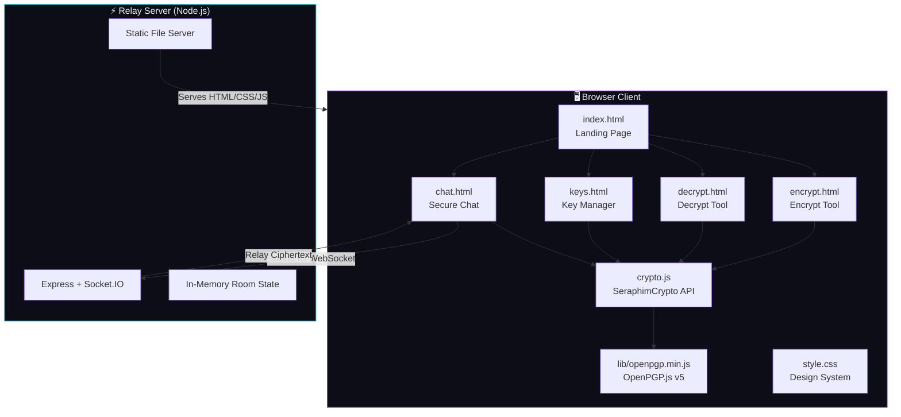
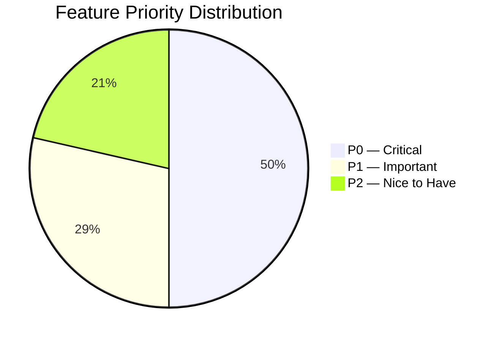
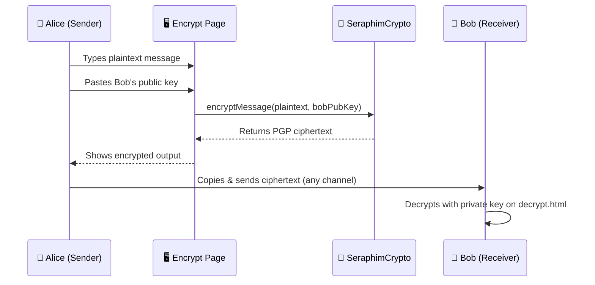
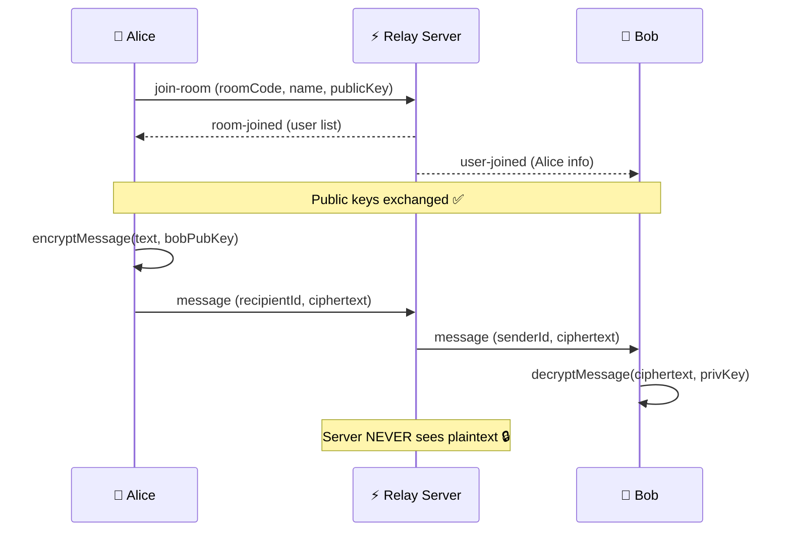
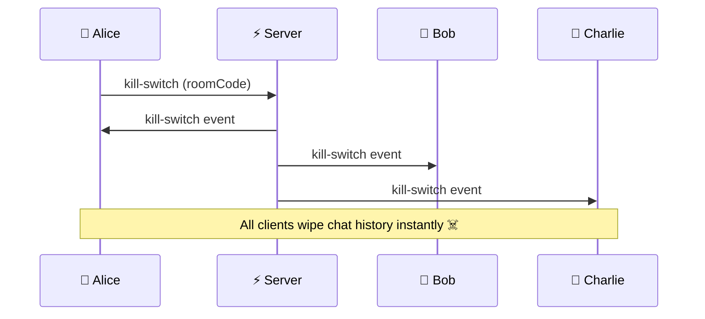
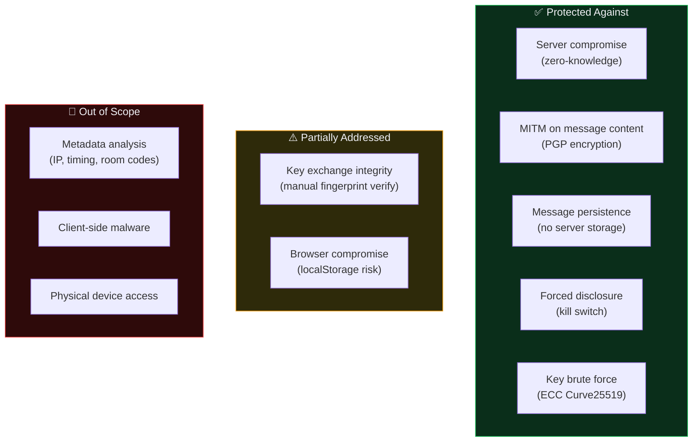
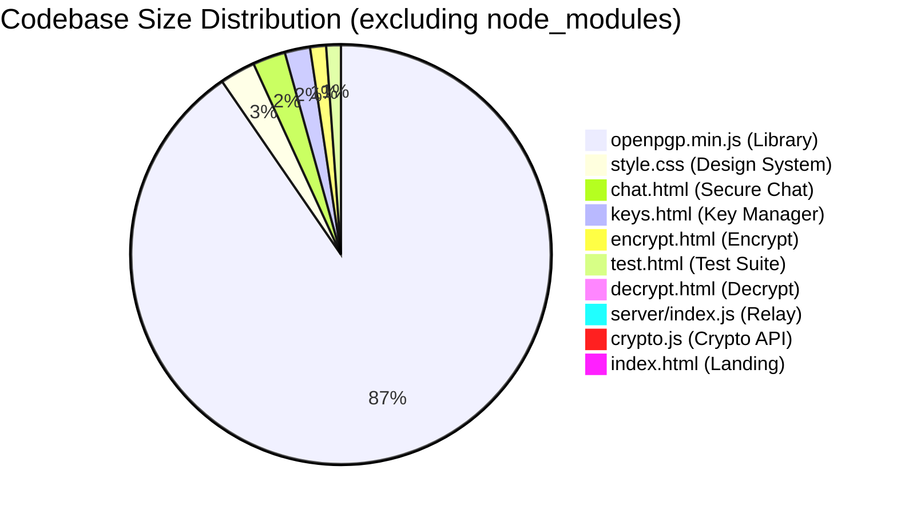

# Seraphim — Product Requirements Document & Technical Report

> **Version:** 1.0 · **Date:** May 4, 2026 · **Author:** Joshua · **Status:** Active Development

---

## 1. Executive Summary

**Seraphim** is a zero-knowledge, end-to-end encrypted (E2EE) messaging platform built entirely in the browser. It uses **OpenPGP.js v5** with **Curve25519 ECC** cryptography to provide users with military-grade encryption for messages, real-time chat, and key management — all without ever exposing plaintext to the server.

The platform operates as a **static web client** + **Node.js relay server**. The server is a dumb pipe — it relays PGP ciphertext between clients and never stores or decrypts any messages.

---

## 2. Product Vision & Goals

| Dimension | Description |
|-----------|-------------|
| **Mission** | Make end-to-end encrypted communication accessible to anyone with a browser |
| **Target Users** | Privacy-conscious individuals, journalists, activists, security researchers |
| **Core Value Prop** | Zero-knowledge architecture — the server cannot read your messages, ever |
| **Differentiator** | Browser-native PGP with no installs, no accounts, no tracking |

---

## 3. System Architecture



---

## 4. Feature Breakdown

### 4.1 Feature Matrix

| Feature | Page | Status | Priority |
|---------|------|--------|----------|
| Landing / Navigation Hub | `index.html` | ✅ Complete | P0 |
| PGP Message Encryption | `encrypt.html` | ✅ Complete | P0 |
| PGP Message Decryption | `decrypt.html` | ✅ Complete | P0 |
| ECC Key Generation (Curve25519) | `keys.html` | ✅ Complete | P0 |
| Key Storage (localStorage) | `keys.html` | ✅ Complete | P0 |
| Contact Management | `keys.html` | ✅ Complete | P1 |
| Real-time E2EE Chat | `chat.html` | ✅ Complete | P0 |
| Room-based Chat System | `chat.html` + server | ✅ Complete | P0 |
| Kill Switch (wipe all messages) | `chat.html` + server | ✅ Complete | P0 |
| Typing Indicators | `chat.html` + server | ✅ Complete | P2 |
| Message Signing | `crypto.js` | ✅ Complete | P1 |
| Signature Verification | `crypto.js` | ✅ Complete | P1 |
| Crypto Test Suite | `test.html` | ✅ Complete | P1 |
| .pgp File Download | `encrypt.html` | ✅ Complete | P2 |

### 4.2 Feature Priority Distribution



---

## 5. User Flows

### 5.1 Encrypt & Send Flow



### 5.2 Real-time Chat Flow



### 5.3 Kill Switch Flow



---

## 6. Technology Stack

```mermaid
graph LR
    subgraph Frontend
        HTML5["HTML5"]
        CSS3["CSS3<br/>Custom Properties"]
        JS["Vanilla JavaScript"]
        OPENPGP["OpenPGP.js v5<br/>(552KB)"]
    end

    subgraph Backend
        NODE["Node.js"]
        EXPRESS["Express 4.18"]
        SOCKETIO["Socket.IO 4.7.4"]
        CORS["CORS 2.8.5"]
        UUID["UUID 9.0.0"]
    end

    subgraph Crypto
        ECC["ECC Curve25519"]
        PGP["PGP Standard"]
        AES["AES-256 (internal)"]
    end

    Frontend --> Crypto
    Backend --> Frontend

    style Frontend fill:#1a0a2e,stroke:#a855f7,color:#f0f0f5
    style Backend fill:#0a1a2e,stroke:#06b6d4,color:#f0f0f5
    style Crypto fill:#0a2e1a,stroke:#22c55e,color:#f0f0f5
```



### Dependency Breakdown

| Package | Version | Size | Purpose |
|---------|---------|------|---------|
| `express` | ^4.18.2 | ~200KB | HTTP server & static file serving |
| `socket.io` | ^4.7.4 | ~300KB | Real-time WebSocket communication |
| `cors` | ^2.8.5 | ~10KB | Cross-Origin Resource Sharing |
| `uuid` | ^9.0.0 | ~15KB | Unique identifier generation |
| `openpgp.min.js` | v5 | 552KB | Client-side PGP cryptography |

---

## 7. Security Model

### 7.1 Threat Model



### 7.2 Encryption Flow

| Step | Operation | Algorithm |
|------|-----------|-----------|
| 1 | Key Generation | ECC Curve25519 |
| 2 | Private Key Protection | AES-256 with passphrase |
| 3 | Message Encryption | PGP (AES-256 session key + ECC) |
| 4 | Message Signing | EdDSA (Ed25519) |
| 5 | Transport | Socket.IO (WSS recommended) |

---

## 8. File Structure & Codebase Analysis

```
Seraphim-morefeatures/
├── index.html          (2.3 KB)  — Landing page with 4 tool cards
├── encrypt.html        (7.5 KB)  — Message encryption interface
├── decrypt.html        (6.2 KB)  — Message decryption interface  
├── keys.html           (11.9 KB) — Key generation & management
├── chat.html           (15.4 KB) — Real-time E2EE chat
├── test.html           (6.9 KB)  — Crypto test suite
├── style.css           (16.7 KB) — Global design system
├── crypto.js           (6.1 KB)  — SeraphimCrypto wrapper API
├── lib/
│   └── openpgp.min.js  (552 KB)  — OpenPGP.js v5 library
├── server/
│   ├── index.js        (6.3 KB)  — Express + Socket.IO relay
│   ├── package.json    (352 B)   — Server dependencies
│   └── node_modules/             — Installed packages
└── package-lock.json   (100 B)   — Root lockfile (empty)
```

### Code Size Distribution



---

## 9. Design System Summary

| Token | Value | Usage |
|-------|-------|-------|
| `--bg-primary` | `#07070d` | Main background (near-black) |
| `--accent-purple` | `#a855f7` | Primary brand color |
| `--accent-cyan` | `#06b6d4` | Secondary accent |
| `--accent-pink` | `#ec4899` | Tertiary accent |
| `--font-sans` | Inter | Body typography |
| `--font-mono` | JetBrains Mono | Code / keys / ciphertext |
| `--radius-lg` | 16px | Card border radius |
| `--gradient-primary` | purple → cyan | Buttons, headings, logo |

**Design Language:** Dark cyberpunk with glassmorphism, neon accents, and smooth micro-animations.

---

## 10. API Reference — SeraphimCrypto

| Method | Parameters | Returns | Description |
|--------|-----------|---------|-------------|
| `generateKeyPair` | name, email, passphrase | `{publicKey, privateKey}` | Generate ECC Curve25519 keypair |
| `encryptMessage` | plaintext, publicKey(s) | ciphertext string | PGP encrypt for recipient(s) |
| `decryptMessage` | ciphertext, privateKey, passphrase | plaintext string | PGP decrypt with private key |
| `signMessage` | plaintext, privateKey, passphrase | signed message | Cleartext PGP signature |
| `verifySignature` | signedMessage, publicKey | `{verified, data}` | Verify cleartext signature |
| `getFingerprint` | publicKey | hex string | Extract key fingerprint |
| `generateRoomCode` | length (default 6) | string | Cryptographic random room code |

---

## 11. Server Events (Socket.IO)

| Event | Direction | Payload | Description |
|-------|-----------|---------|-------------|
| `join-room` | Client → Server | `{roomCode, name, publicKey}` | Join/create a chat room |
| `room-joined` | Server → Client | `{roomCode, users[]}` | Confirm join + user list |
| `user-joined` | Server → Others | `{id, name, publicKey}` | New user notification |
| `user-left` | Server → Others | `{id, name}` | User departure notification |
| `message` | Client → Server | `{roomCode, encryptedMessages[]}` | Send per-recipient ciphertext |
| `message` | Server → Client | `{senderId, senderName, ciphertext, timestamp}` | Relay encrypted message |
| `kill-switch` | Bidirectional | `{roomCode}` / `{triggeredBy, timestamp}` | Wipe all messages |
| `typing` | Bidirectional | `{roomCode}` / `{name}` | Typing indicator |

---

## 12. Performance Metrics (Estimated)

| Operation | Estimated Time | Notes |
|-----------|---------------|-------|
| Key Generation (Curve25519) | ~200-500ms | First-time only |
| Message Encryption | ~50-150ms | Depends on message size |
| Message Decryption | ~50-150ms | Includes passphrase unlock |
| Message Signing | ~50-100ms | Ed25519 |
| Signature Verification | ~30-80ms | Ed25519 |
| Room Join (WebSocket) | ~50-200ms | Network dependent |

---

## 13. Future Roadmap

| Feature | Priority | Complexity | Status |
|---------|----------|------------|--------|
| File/Image Encryption | P1 | Medium | 🔲 Planned |
| Group Key Rotation | P1 | High | 🔲 Planned |
| QR Code Key Exchange | P2 | Low | 🔲 Planned |
| Voice Messages (encrypted) | P2 | High | 🔲 Planned |
| PWA / Offline Support | P2 | Medium | 🔲 Planned |
| Tor/I2P Integration | P3 | High | 🔲 Research |
| Self-destructing Messages (timer) | P2 | Low | 🔲 Planned |
| Multi-device Key Sync | P3 | High | 🔲 Research |

---

---

# PART 2: Google Stitch Prompts — Per Layout

Below are specific prompts to use in **Google Stitch** for generating layout designs for each page of Seraphim.

---

## Layout 1: Landing Page (`index.html`)

**Description:** A dark, centered hero page. Contains a logo/title at the top, a hero tagline, and a 2×2 grid of feature cards (Encrypt, Decrypt, Key Manager, Secure Chat). Each card has an icon, title, and short description. Footer shows tech stack info.

**Google Stitch Prompt:**

> Design a dark-themed landing page for an encrypted messaging app called "Seraphim". Background is near-black (#07070d) with subtle purple and cyan radial gradient glows. At the top is a logo with a lock emoji and gradient text "Seraphim" (purple to cyan). Below it, a hero section with the heading "End-to-End Encrypted Messaging" in gradient text and a tagline: "Zero-knowledge encryption powered by OpenPGP. Your messages. Your keys. No middleman." Below that, a 2x2 grid of glassmorphism cards with dark semi-transparent backgrounds, subtle borders, and hover glow effects. Each card has a gradient icon box (lock, unlock, key, chat bubble), a bold title, and a short description in muted text. Cards: "Encrypt", "Decrypt", "Key Manager", "Secure Chat". Footer text: "Powered by OpenPGP.js v5 · Curve25519 ECC · Zero-knowledge relay". Typography uses Inter font. Overall aesthetic is cyberpunk, premium, dark, with purple/cyan neon accents.

---

## Layout 2: Encrypt Page (`encrypt.html`)

**Description:** A tool page with a navigation bar, a title section, and a main card containing a message textarea, a public key textarea, a contact loader button, and an encrypt button. Below it, a conditionally-visible output card shows the PGP ciphertext with copy and download buttons.

**Google Stitch Prompt:**

> Design a dark-themed encryption tool page for "Seraphim". Top has a header with logo (left) and a pill-shaped navigation bar (right) with tabs: Encrypt (active/highlighted with purple-cyan gradient), Decrypt, Keys, Chat. Below is a centered heading "🔒 Encrypt Message" in gradient text with subtitle. Main content is a glassmorphism card with: a "Message" textarea (tall, dark input background), a "Recipient's Public Key" textarea with a ghost button "📇 Load from contacts", and a large gradient "🔒 Encrypt Message" button with purple glow shadow. Below that card, an output card labeled "Encrypted Output" shows PGP ciphertext in cyan monospace text on a dark background, with "📋 Copy to Clipboard" and "💾 Download .pgp" buttons. Background is near-black with subtle purple/cyan ambient glows. All inputs have focus states with purple border glow.

---

## Layout 3: Decrypt Page (`decrypt.html`)

**Description:** Similar to encrypt but with fields for: encrypted message textarea, private key textarea (with a "load saved key" button), passphrase input, and a decrypt button. Output card shows decrypted plaintext in green.

**Google Stitch Prompt:**

> Design a dark-themed decryption tool page for "Seraphim". Same header/nav structure as encrypt page but "Decrypt" tab is active. Heading: "🔓 Decrypt Message" in gradient text. Main card contains: an "Encrypted Message" textarea (tall, monospace placeholder showing PGP message header), a "Your Private Key" textarea with a "🔑 Load saved key" ghost button below it, a "Passphrase" password input, and a gradient "🔓 Decrypt Message" action button. Below, a second card shows the decrypted output in green (#22c55e) monospace text with a copy button. Dark cyberpunk aesthetic with glassmorphism cards, near-black background (#07070d), purple/cyan accents, Inter font for labels, JetBrains Mono for code blocks.

---

## Layout 4: Key Manager (`keys.html`)

**Description:** A multi-section page with: (1) Generate Keypair card with name/email/passphrase fields, (2) Generated output card showing public and private keys with copy/save buttons, (3) Saved Keys list card showing key cards with fingerprints and export/delete actions, (4) Contacts card with a list and "Add Contact" button that opens a modal overlay.

**Google Stitch Prompt:**

> Design a dark-themed PGP key management page for "Seraphim". Header with logo + nav bar (Keys tab active). Heading: "🔑 Key Manager" in gradient text. Page has 4 stacked glassmorphism cards: (1) "Generate New Keypair" card — subtitle "ECC Curve25519", two-column row for Name and Email inputs, a Passphrase input below, and a gradient "⚡ Generate Keys" button. (2) "Generated Keypair" output card — shows public key in cyan monospace and private key in pink monospace within dark boxes, with copy buttons and a "💾 Save to Browser" button. (3) "My Saved Keys" card — shows a vertical list of key items with name, email, fingerprint (cyan monospace), and action buttons (export public, export private, delete). (4) "Contacts" card — a list of saved contacts with name and action buttons, plus an "➕ Add Contact" button. All on near-black background with glassmorphism, purple/cyan glow accents, and smooth hover states.

---

## Layout 5: Secure Chat (`chat.html`)

**Description:** Two-panel layout. First panel (join): a centered card with display name, keypair selector, passphrase, and room code fields with a join button. Second panel (chat room): a top bar showing room code + kill switch + leave buttons, a main area with a messages column (left) and users sidebar (right), and a message input bar at the bottom.

**Google Stitch Prompt:**

> Design a dark-themed encrypted chat room for "Seraphim". Two states: (1) JOIN STATE — centered card with heading "💬 Secure Chat", subtitle about E2EE. Card has fields: Display Name input, Keypair dropdown selector, Passphrase input, Room Code input with a "🎲 New" button beside it, and a large gradient "🚀 Join Room" button. (2) CHAT STATE — full-width layout with a top bar showing room code in cyan monospace + "Copy" button + "☠️ Kill Switch" red button + "🚪 Leave" ghost button. Below is a two-column layout: left (75%) has a messages area with sent messages (right-aligned, purple/cyan gradient background) and received messages (left-aligned, dark background) plus system messages (centered, cyan tint), a typing indicator line, and a message input bar with text input + "Send" gradient button. Right sidebar (25%) shows "Online Users" with green pulse dots next to names. Near-black background, glassmorphism, cyberpunk aesthetic.

---

## Layout 6: Test Suite (`test.html`)

**Description:** Minimal developer page with a heading, a "Run All Tests" button, and a terminal-style output box showing test results with colored pass/fail indicators.

**Google Stitch Prompt:**

> Design a minimal dark developer test page. Background is very dark (#0a0a0f). Title "🔐 Seraphim Crypto Test Suite" in purple. A gradient purple-to-cyan button labeled "Run All Tests". Below, a terminal-style output box with dark background (#111118), thin border, monospace font showing test output lines. Pass results in green (#22c55e), fail in red (#ef4444), info lines in blue (#38bdf8), dim/meta text in gray (#555). Output shows numbered tests: Key Generation, Encryption, Decryption, Signing, Verification, Wrong Passphrase rejection, Room Code Generation — each with timing and status indicators. Clean, developer-focused, no glassmorphism.

---

---

# PART 3: UI Design Prompts — Dark Theme with Hero Image

These are prompts for generating UI mockup images for Seraphim with a **black theme and hero image centered in front**.

---

## Main Hero / Landing Page UI Prompt

> **Prompt for UI generation:**
>
> A stunning dark-mode landing page UI for "Seraphim" — an encrypted messaging app. Pure black background (#07070d) with very subtle purple (#a855f7) and cyan (#06b6d4) ambient gradient glows in the corners. In the center of the page, a large, bold, photorealistic hero image of a glowing angelic wing made of circuit board traces and encryption symbols, rendered in purple and cyan neon light against the black background. The wing radiates soft light particles. Above the image, the word "Seraphim" in large bold Inter font with a purple-to-cyan gradient. Below the image, tagline: "Zero-Knowledge Encrypted Messaging" in muted gray text. Below that, four small dark glassmorphism cards in a row: Encrypt (lock icon), Decrypt (unlock icon), Keys (key icon), Chat (chat bubble icon). Each card has a subtle border glow on hover. Ultra-premium, cyberpunk aesthetic. No device frames. 1920x1080.

---

## Encrypt Page UI Prompt

> **Prompt for UI generation:**
>
> Dark-mode UI for an encryption tool page. Black background (#07070d) with subtle purple ambient glow in top-left corner. Top navigation bar with "Seraphim" logo (gradient text) on left and a frosted glass pill-shaped nav with tabs. Main content area has a large glassmorphism card with dark semi-transparent background and thin glowing border. Inside: a "Message" text area with dark input styling, a "Public Key" text area, and a prominent gradient purple-to-cyan "Encrypt" button with glow shadow. Below, a second card shows encrypted PGP output in cyan monospace font. Clean, spacious layout with Inter typography. Professional, premium encryption tool aesthetic. No device frames. 1920x1080.

---

## Chat Room UI Prompt

> **Prompt for UI generation:**
>
> Dark-mode UI for an encrypted chat room interface. Pure black background. Top bar shows room code in cyan monospace, a red "Kill Switch" button, and a "Leave" button. Main chat area on the left shows a conversation with sent messages (right-aligned, subtle purple gradient background, rounded corners) and received messages (left-aligned, dark glass background). System messages centered in cyan tint. Message input bar at bottom with dark text field and gradient send button. Right sidebar shows "Online Users" panel with green pulse dots next to user names. Glassmorphism cards, purple/cyan neon accents on the black background. Real-time messaging interface feel. Ultra-premium, cyberpunk aesthetic. No device frames. 1920x1080.

---

## Key Manager UI Prompt

> **Prompt for UI generation:**
>
> Dark-mode UI for a PGP key management dashboard. Black background with subtle cyan glow in bottom-right. Multiple stacked glassmorphism cards: top card has "Generate Keypair" form with name, email, passphrase fields in a clean layout and a glowing gradient "Generate" button. Middle card shows generated keys — public key in a cyan-tinted code box and private key in a pink-tinted code box with copy buttons. Bottom card shows "Saved Keys" as a list of key items, each showing name, email, fingerprint in cyan monospace, with export and delete action buttons. Clean, organized, dashboard-like layout. Inter font for labels, JetBrains Mono for keys. No device frames. 1920x1080.

---

## Decrypt Page UI Prompt

> **Prompt for UI generation:**
>
> Dark-mode UI for a message decryption tool. Black background (#07070d) with subtle green ambient glow hint. Glassmorphism card containing: a large "Encrypted Message" textarea with PGP message placeholder, a "Private Key" textarea, a passphrase input field, and a gradient "Decrypt" action button. Below, a second card shows the decrypted plaintext in bright green (#22c55e) monospace text on a dark background, with a copy button. Navigation bar at top matching the overall Seraphim design. Clean, focused, single-purpose tool interface. No device frames. 1920x1080.

---

## Mobile / Responsive UI Prompt

> **Prompt for UI generation:**
>
> Mobile-responsive dark UI for "Seraphim" encrypted messaging app shown on a phone viewport (390px wide). Black background. Landing page state: Seraphim logo at top with gradient text, hero tagline centered, and 4 feature cards stacked vertically in a single column. Each card has an icon, title, and description with glassmorphism styling. Navigation collapses to a compact pill bar. Chat view: full-screen message area with sent/received bubbles, bottom input bar with send button, hamburger menu for sidebar. Touch-friendly button sizes. Purple/cyan accent colors on pure black. Premium mobile-first design. No device frames. 390x844.
